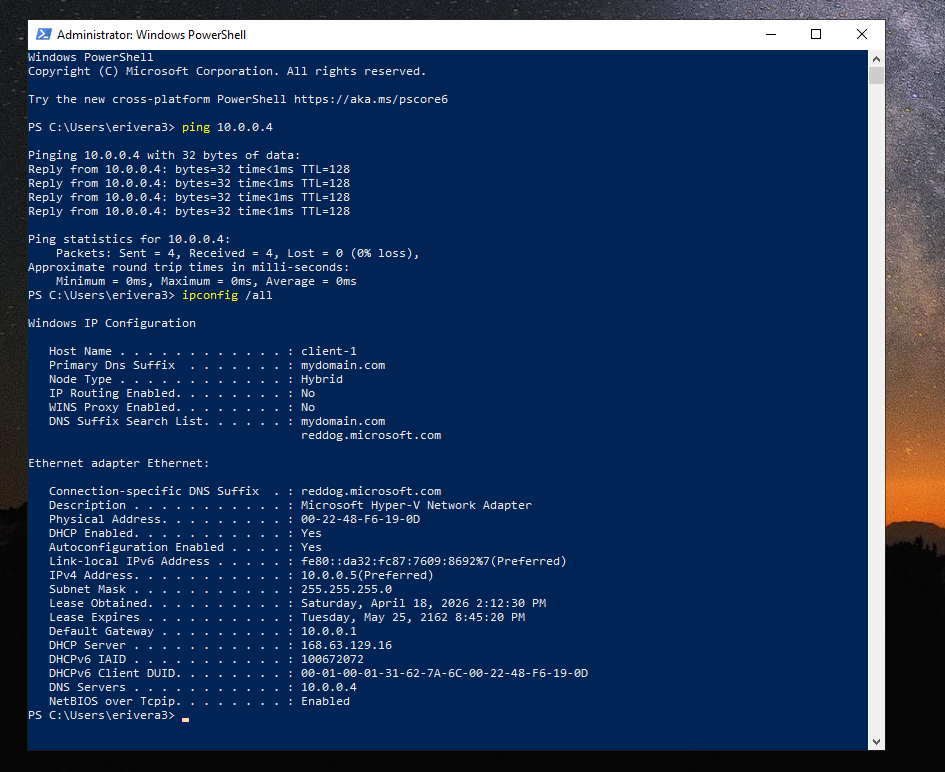
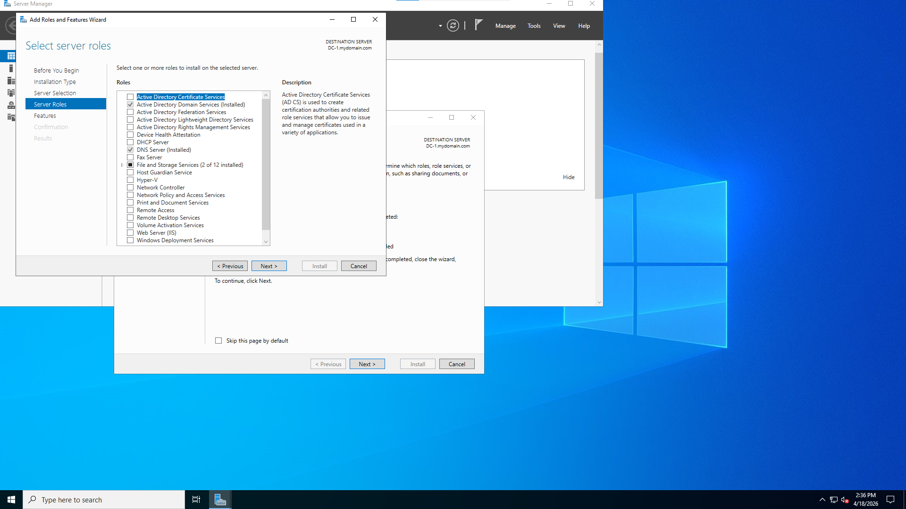
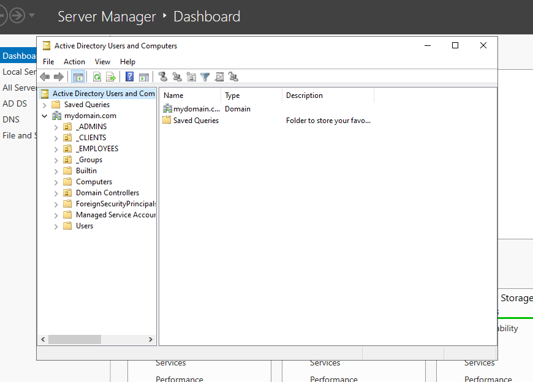
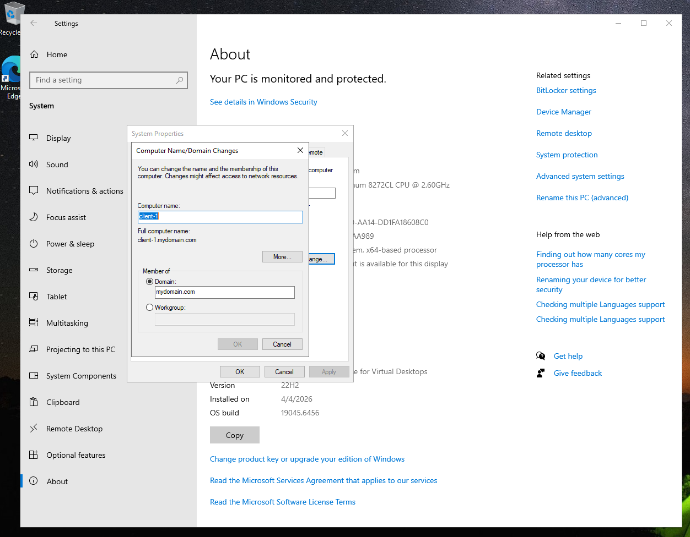
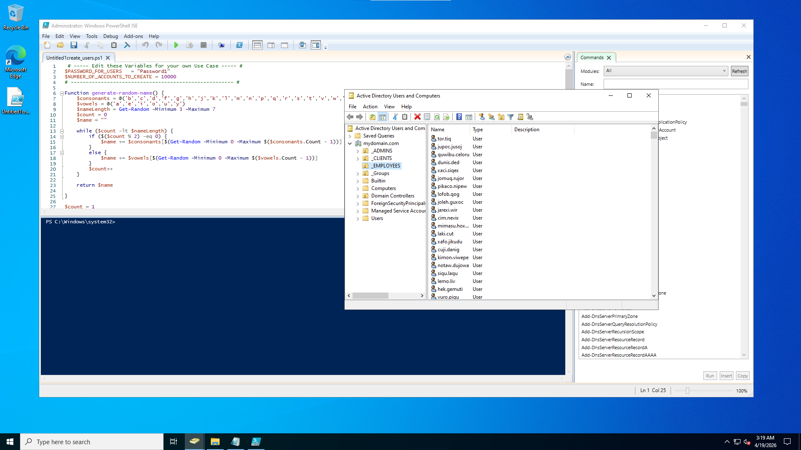
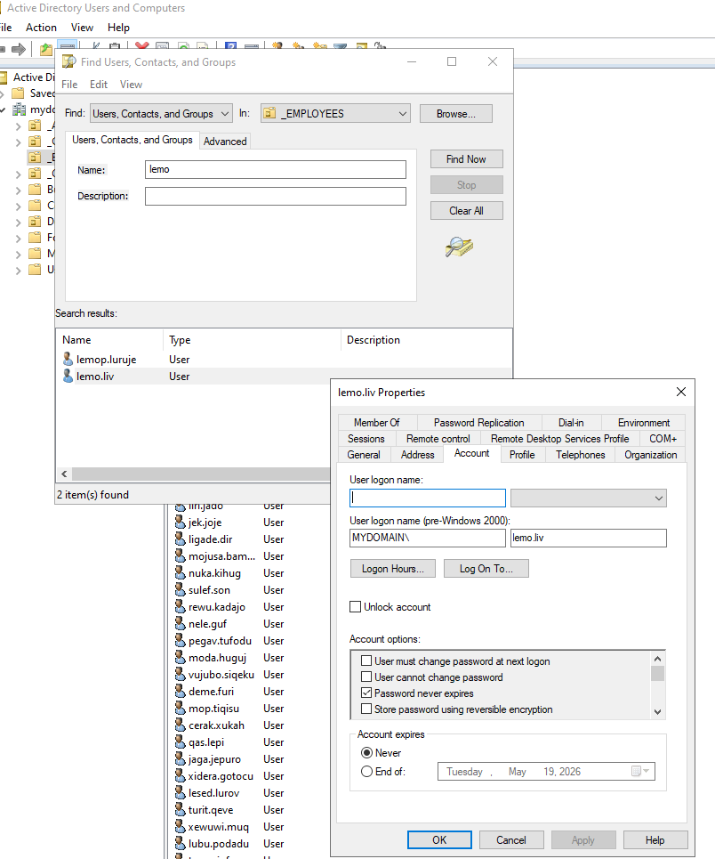
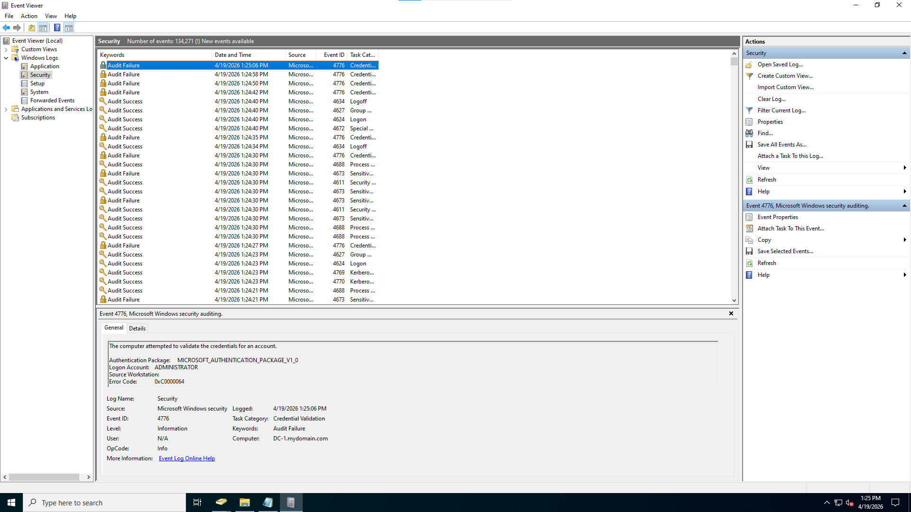

  

<h1 align="center"># Active Directory Deployment in Azure (Enterprise Simulation)</h1>

---

## 🎯 Goals & Objectives

The goal of this project was to build a working Active Directory environment in Azure and understand how core components like DNS, networking, and authentication work together.

By the end of this lab, I aimed to:

- Deploy a Domain Controller in Azure
- Configure Active Directory Domain Services (AD DS)
- Join a client machine to the domain
- Create and manage users and Organizational Units
- Implement and test account lockout policies
- Improve my troubleshooting skills

---

## 📌 Overview

In this project, I set up a Domain Controller and a client machine in Azure to simulate a basic enterprise environment. The focus was on understanding how systems communicate, how users are managed, and how security policies affect authentication.

---

## 🧰 Technologies Used

- Microsoft Azure (Virtual Machines)
- Active Directory Domain Services (AD DS)
- Remote Desktop Protocol (RDP)
- PowerShell
- Group Policy
- DNS

---

## 💻 Environment

- Windows Server 2022 (DC-1)
- Windows 10 (Client-1)
- Domain: `mydomain.com`
- Azure Virtual Network

---

## ⚙️ Implementation

### 1. Infrastructure Setup
- Created a Virtual Network and two VMs (DC-1 and Client-1)
- Set the Domain Controller to use a static private IP

  

---

### 2. DNS & Connectivity
- Set Client-1’s DNS to point to the Domain Controller
- Verified connectivity using:
  - `ping`
  - `ipconfig /all`

  

---

### 3. Active Directory Setup
- Installed AD DS on DC-1
- Promoted it to a Domain Controller
- Created domain: `mydomain.com`

  

---

### 4. User & OU Setup
- Created Organizational Units:
  - `_ADMINS`
  - `_EMPLOYEES`
  - `_CLIENTS`
- Created admin account: `jane_admin`

  

---

### 5. Domain Join
- Joined Client-1 to the domain
- Verified it appeared in Active Directory
- Moved it into `_CLIENTS` OU

  

---

### 6. User Creation
- Used PowerShell to create multiple user accounts
- Verified they appeared in Active Directory

  

---

### 7. Account Lockout Policy
- Configured lockout policy using Group Policy
- Forced update with `gpupdate /force`
- Triggered lockouts with failed login attempts

  

---

### 8. Account Management & Logs
- Unlocked accounts and reset passwords
- Disabled and re-enabled users
- Checked logs using Event Viewer

  

---

## 🔍 Troubleshooting

### DNS Issue
- Problem: Client could not join the domain
- Cause: Client was using Azure default DNS
- Fix: Changed DNS to Domain Controller IP

### Network Issue (Subnet Understanding)
- Problem: Machines could not communicate
- Cause: Network configuration mismatch
- Fix:
  - Verified both VMs were in the same network
  - Confirmed connectivity using ping

### Log Analysis Challenge
- Initially expected logs to clearly show issues
- Found that logs contain a lot of information and require filtering
- Learned that identifying useful events takes practice

---

## 🧠 Design Decisions

- Used a static IP for the Domain Controller to avoid DNS issues
- Created a separate admin account instead of using the default administrator
- Organized users and computers into OUs for better structure
- Used PowerShell for faster user creation

---

## 🛡️ Security Awareness

- Triggered account lockouts through failed login attempts
- Observed how login attempts are recorded in logs
- Noted that without careful review, important events can be missed

---

## 🌍 Real-World Relevance

- Active Directory is commonly used in enterprise environments
- DNS configuration is critical for system communication
- Group Policy is used to manage users and security settings
- Logs are important but require proper tools and attention

---

## 📌 Lessons Learned

- DNS is critical for Active Directory to function
- Network configuration directly affects connectivity
- Logs are not always easy to interpret
- Troubleshooting takes time and testing
- Small configuration mistakes can break entire systems

---

## 💭 Personal Reflection

Before this lab, I assumed most system issues would be obvious and easy to identify. In practice, I found that problems like DNS misconfiguration, subnet issues, and authentication failures required step-by-step troubleshooting.

I also learned that logs do contain useful information, but they are not simple to read without knowing what to look for.

This lab helped me shift from just following steps to actually thinking through how systems work and how to diagnose issues when something breaks.
