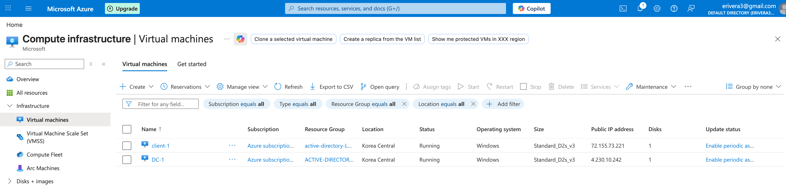

  

<h1 align="center">Active Directory Deployment in Azure (Identity, DNS, and Authentication Troubleshooting)</h1>

This project focuses on deploying a working Active Directory environment in Azure and resolving the failures that prevent domain communication, authentication, and policy enforcement.

The objective was not just to configure AD, but to restore functionality when identity and network dependencies failed.

---

## 📌 Context

Active Directory environments depend on multiple systems working correctly:

- DNS resolution  
- Network connectivity  
- Domain controller configuration  
- Client authentication  

Failure in any of these layers prevents domain functionality.

This project tested how those dependencies interact and fail.

---

## 🧰 Technologies Used

- Microsoft Azure (Virtual Machines)  
- Active Directory Domain Services (AD DS)  
- Remote Desktop Protocol (RDP)  
- PowerShell  
- Group Policy  
- DNS  

---

## 💻 Environment

- Windows Server 2022 (DC-1)  
- Windows 10 (Client-1)  
- Domain: `mydomain.com`  
- Azure Virtual Network  

---

## ⚙️ Implementation

### 1. Infrastructure Setup

**Problem:**  
No identity infrastructure available.

**Decision:**  
Deploy domain controller and client system within same virtual network.

**Result:**  
- Base environment created for domain communication  
- Systems reachable via RDP  

  

---

### 2. DNS Failure (Critical Blocker)

**Problem:**  
Client could not join domain.

**Root Cause:**  
Client was using Azure default DNS instead of domain controller.

**Decision:**  
Reconfigure DNS to point directly to domain controller IP.

**Result:**  
- Domain join functionality restored  
- Client able to resolve domain resources  

  

---

### 3. Active Directory Deployment

**Problem:**  
No centralized identity management.

**Decision:**  
Install AD DS and promote server to domain controller.

**Result:**  
- Domain (`mydomain.com`) established  
- Centralized authentication enabled  

  

---

### 4. Organizational Structure

**Problem:**  
Flat user structure creates management and security issues.

**Decision:**  
Create Organizational Units:
- `_ADMINS`
- `_EMPLOYEES`
- `_CLIENTS`

**Result:**  
- Structured identity management  
- Improved policy targeting and control  

  

---

### 5. Domain Join Validation

**Problem:**  
Need to confirm system integration into domain.

**Decision:**  
Join Client-1 to domain and validate placement.

**Result:**  
- Client successfully joined  
- Verified in Active Directory  
- Moved to correct OU  

  

---

### 6. User Provisioning

**Problem:**  
Manual user creation inefficient and error-prone.

**Decision:**  
Use PowerShell to automate account creation.

**Result:**  
- Multiple users created efficiently  
- Verified in Active Directory  

  

---

### 7. Authentication Failure Simulation

**Problem:**  
Need to test security behavior under failed authentication.

**Decision:**  
Configure account lockout policy and trigger failures.

**Result:**  
- Accounts locked after failed attempts  
- Security policy validated  

  

---

### 8. Log Analysis & Account Recovery

**Problem:**  
Need to identify cause of authentication issues.

**Decision:**  
Analyze Event Viewer logs and restore accounts.

**Result:**  
- Accounts unlocked and reset  
- Verified system logging behavior  

  

---

## 🔍 Key Failures & Resolutions

### DNS Misconfiguration
- Cause: Default Azure DNS  
- Fix: Pointed client to domain controller  

### Network Connectivity Issue
- Cause: Incorrect network assumptions  
- Fix: Verified same VNet and connectivity  

### Authentication Lockout
- Cause: Failed login attempts  
- Fix: Reset accounts and validated policy  

---

## 🧠 Decisions That Mattered

- Set static IP for domain controller to prevent DNS instability  
- Used separate admin account instead of default administrator  
- Structured OUs for control and scalability  
- Used PowerShell for efficient provisioning  
- Validated DNS before attempting domain join  

---

## 🛡️ System Understanding

- DNS is the backbone of Active Directory  
- Domain functionality depends on correct name resolution  
- Authentication failures must be validated through logs  
- Network configuration directly affects identity systems  
- Misconfiguration in one layer breaks the entire environment  

---

## 📌 Key Lessons

- DNS misconfiguration is the most common AD failure point  
- Network and identity systems are tightly coupled  
- Logs require interpretation, not just observation  
- Small configuration errors can break authentication entirely  

---

## Summary

This project demonstrates the ability to deploy and troubleshoot a working identity system in a cloud environment.

Key outcomes:

- Restored domain functionality by correcting DNS failures  
- Validated authentication and security policy behavior  
- Built structured identity management using OUs and roles  
- Diagnosed issues across networking, DNS, and authentication layers  

**Result:**  
A functional Active Directory environment where identity, authentication, and policy enforcement work correctly because underlying failures were identified and resolved.
